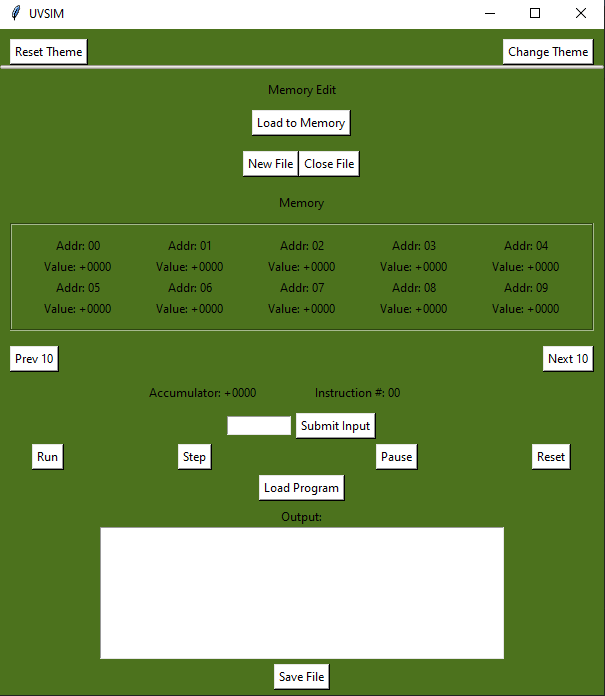
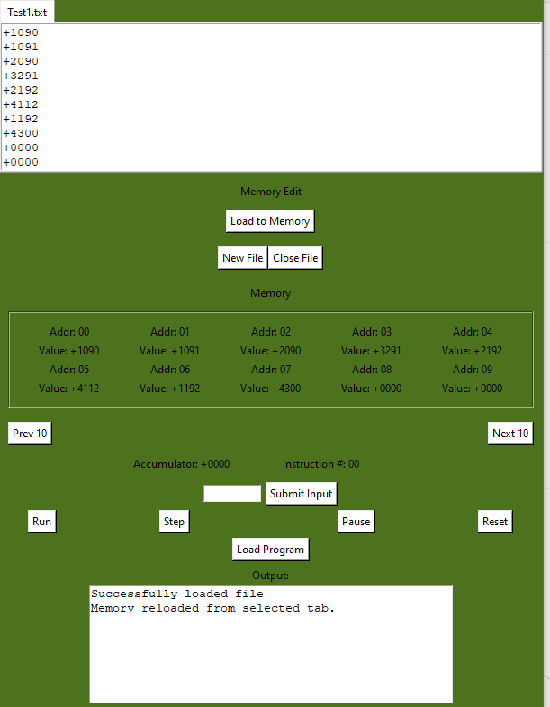
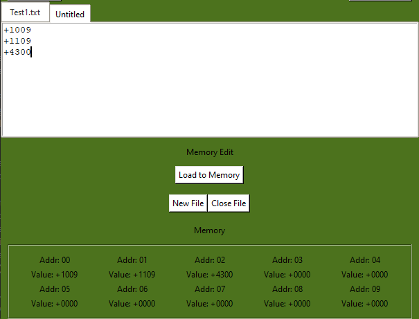
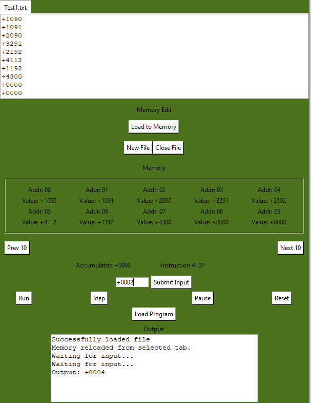
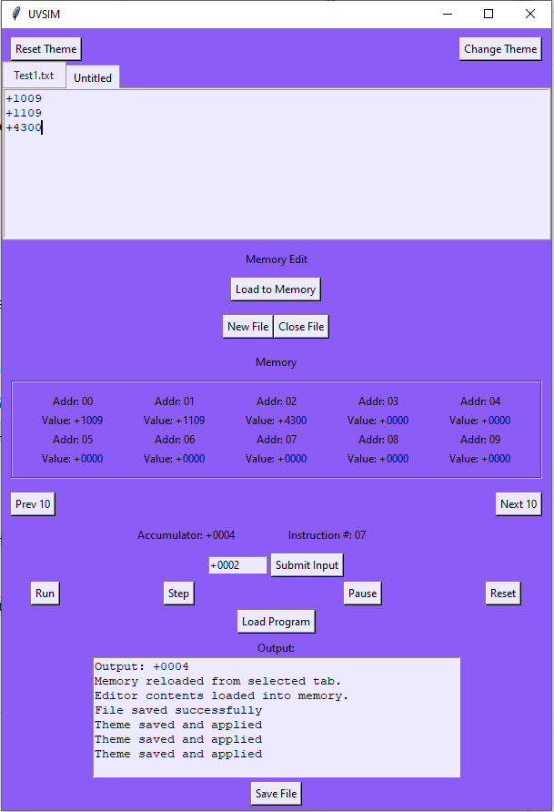
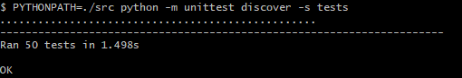
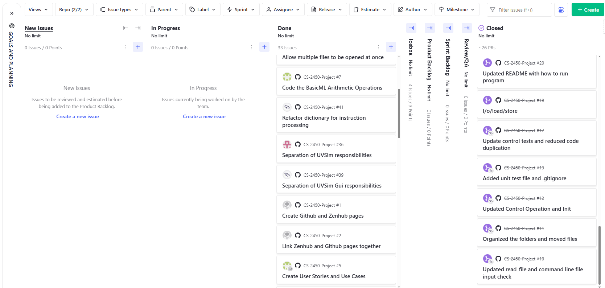

# UVSIM

Version - V1.0

Team Members - Anthony Gill, Brandon Walton, Andie Merino-Osorno

Date - July 31th, 2025

# Table of Contents
- [Overview](#overview)
- [Features](#features)
- [Setup Instructions](#setup-instructions)
- [Usage Guide](#usage-guide)
- [Documentation](#documentation)
- [Testing](#testing)
- [Future Roadmap](#future-roadmap)
- [Zenhub info](#zenhub-info)
- [Presentation](#presentation)
- [Summary](#summary)

# Overview
UVSim is a command-line tool we built to simulate a simple virtual machine that runs programs written in a custom language called BasicML.
It mimics the key parts of a basic computer system—like memory, a CPU, and an accumulator—using a 250-word memory and instructions made up of four or six digits.

The goal of this project was to help students learn how computers process instructions at a low level.
UVSim lets users load, run, and test programs, while showing how operations like reading, writing, and branching work behind the scenes.
By building it, we gained hands-on experience with program execution, control flow, and user input handling.

# Features
- Load and run `.txt` prorgams written in the BasicML instruction format
- Simulates memory and registers
- Interactive GUI to load programs and visualize process
- MVC architecture for a moduar design
- Instruction execution with validation and error handling
- Ability to save programs into separate `.txt` files
- Handles 4 or 6 digit length words in the files

# Setup Instructions

1. **Clone the repository**
    First you will want to go into your desired folder:
    ```cd path/to/folder```
    Clone the repository using:
    ```git clone https://github.com/ayndvee/CS-2450-Project.git```
2. **Install Dependencies**
    If you are using MacOS to ensure that all theme functionality works as intended we would suggest running:
    ``` pip install -r requirements.txt ```
    The program will still run without it, but all visual elements may not appread as intended
3. **Running the Program**
    Run the program from the src folder. The program can be run in two different ways:
    1. From the command line
    2. From a GUI
    ## Command line
    ```
    python main.py <filename>
    ```

    or

    ```
    python main.py <filepath>
    ```

    ## GUI
    ```
    python main.py
    ```
    Once the GUI is up an running you will then be able to input the file and test it out.


    ### Example
    File in the same directory:
    ```
    python main.py Test1.txt
    ```

    ### File Path Example
    Full file path for text file:
    ```
    python main.py /c/Users/name/Documents/Test1.txt
    ```

    Relative path from project root:
    ```
    python ./UVSim-Project/src/main.py Test1.txt
    ```


    Also make sure that the program you want to run is a BasicML program.

# Usage Guide
## 1. Run the Program
To start the UVSIMGUI go into the src folder and type:
``` python main.py ```
## 2. Navigating the GUI
Once the program runs the GUI will pop up.
You will see the memory area, buttons, and input/output areas.

## 2. Loading a Program File
- Click on the "Load Program" button to open a file selecting dialog.
- Select a ```.txt``` file that has BasicML instructions in it.

## 3. Editing Code
- Edit directly in the text tab area
- Multiple tabs can support managing different files


## 4. Running the Program
- Use either the Run or the Step buttons to start the program
- The accumulator and instruction count will update as the program runs
- The output area will display the output and system messages
- If you would like to re-run the code press the "reset" button.

## 5. Saving the File
- Once the Program has run or edits have been made click the Save Program button
- A save program dialog will pop up, save it as a ```.txt```

## 6. Customizing Theme
- Select the "Change Theme" button
- It will open up 2 color picker option menus, one primary color, and one off color
- Once selected it will set the theme on the GUI
- If you want to reset the theme back to original press "Reset Theme" button


# Documentation
For this project we organized it by using the Model-View-Controller architecture.

## Model
- UVSim
- CPU
- IOHandler
- Memory
## Controller
- UVSimController
- ExecutionController
- ThemeController
- FileController
## View
- UVSimGUI
- TabManager

Additional Documentation:
- Use cases/User Stories [Use Cases/User Stories](UVSim-Project/Documentation//Design-Document.md)
- Class Design: [Class Design](UVSim-Project/Documentation/class_design.md)
- SRS: [SRS](UVSim-Project/Documentation/SRS_Final.md)
- UML: [UML](UVSim-Project/Documentation/UML_Design.md)
- Wireframe: [Wireframe](UVSim-Project/Documentation/Wireframe_UI.md)
- Code Coverage Report: [Code Coverage Report](UVSim-Project/Documentation/code_coverage.md)
- Final System Test Report: [Final System test report](UVSim-Project/Documentation/final_system_test_report.md)

# Testing
- All of our unit tests are in the tests directory
- Go to the UVSim-Project folder to run the tests:
```PYTHONPATH=./src python -m unittest discover -s tests```


Test Coverage includes:
- Instruction checks
- Memory operations
- Input/Output behavior
- Edge case handling

Results of our test cases:
- UVSim: [UVSim test case](UVSim-Project/Documentation/unittest_spreadsheets/unit-tests-spreadsheet.md)
- UVSimGUI: [UVSim gui test case](UVSim-Project/Documentation/unittest_spreadsheets/unit-tests-gui-spreadsheet.md)
- UVSimController: [UVSim controller test case](UVSim-Project/Documentation//unittest_spreadsheets/unit-tests-controller.md)
- UVSim Memory: [UVSim memory test case](UVSim-Project/Documentation/unittest_spreadsheets/unit-tests-memory-spreadsheet.md)
  


# Future Roadmap
- Add more support for breakpoints or step-through execution to help users pause at specific memory addresses or instructions, enabling better debugging and instructional control. Visual indicators in the GUI could highlight the current instruction, and users could optionally step through execution one instruction at a time.
- Enhance the error feedback in the GUI by providing clear, descriptive messages when invalid opcodes, operands, or inputs are encountered. This could include highlighting problematic memory cells, offering fix suggestions, and displaying real-time validation errors before program execution begins.

# Zenhub Info
We used Zenhub for our project tracking.
We had used it to help split up the tasks and create issues for sections of each milestone.
Here is a link to the zenhub board:
[Zenhub Board](https://app.zenhub.com/workspaces/g1-6848914cee378d003143c970/board)
Here is a picture of the board:


# Presentation
We created a presentation going over the basics of our project. IT includes an overview, requirements, functionality, and much more.

Here is the link to our presentation about our project: [UVSIM Presentation](UVSim-Project/Documentation/Presentation/UVSim-presentation.pptx)

Here is the link in case that doesn't work: [Presentation Link](https://docs.google.com/presentation/d/1XrM8OKWD91WxS3EmjA8GUOqOsjgH6A-RQ7gEmtJ93w4/edit?pli=1&slide=id.p#slide=id.p)

# Summary
We have created a summary document of the project, it focuses on the performace, our main challenges, and key takeaways we had.

[Project Summary](UVSim-Project/Documentation/Project_Summary.md)
